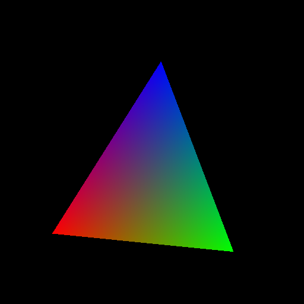

Headless on Ubuntu 18 Server
============================

Dependencies
------------

Headless rendering can be achieved with EGL or X11.
We'll cover both cases.

Starting with fresh ubuntu 18 server install we need to install required
packages::

    sudo apt-install python3-pip mesa-utils libegl1-mesa xvfb

This should install mesa an diagnostic tools if needed later.

* ``mesa-utils`` installs libgl1-mesa and tools like ``glxinfo```
* ``libegl1-mesa`` is optional if using EGL instead of X11

Creating a context
------------------

The libraries we are going to interact with has the following locations::

    /usr/lib/x86_64-linux-gnu/libGL.so.1
    /usr/lib/x86_64-linux-gnu/libX11.so.6
    /usr/lib/x86_64-linux-gnu/libEGL.so.1

Double check that you have these libraries installed. ModernGL
through the glcontext library will use ``ctype.find_library``
to locate the latest installed version.

Before we can create a context we to run a virtual display::

    export DISPLAY=:99.0
    Xvfb :99 -screen 0 640x480x24 &

Now we can create a context with x11 or egl:

.. code::

    # X11
    import moderngl
    ctx = moderngl.create_context(
        standalone=True,
        # These are OPTIONAL if you want to load a specific version
        libgl='libGL.so.1',
        libx11='libX11.so.6',
    )

    # EGL
    import moderngl
    ctx = moderngl.create_context(
        standalone=True,
        backend='egl',
        # These are OPTIONAL if you want to load a specific version
        libgl='libGL.so.1',
        libegl='libEGL.so.1',
    )


Running an example
------------------

Checking that everything works can be done with a basic triangle example.

Install dependencies::

    pip3 install moderngl numpy pyrr pillow

The following example renders a triangle and writes
it to a png file so we can verify the contents.



.. code:: python

    import moderngl
    import numpy as np
    from PIL import Image
    from pyrr import Matrix44

    # -------------------
    # CREATE CONTEXT HERE
    # -------------------

    prog = ctx.program(vertex_shader="""
        #version 330
        uniform mat4 model;
        in vec2 in_vert;
        in vec3 in_color;
        out vec3 color;
        void main() {
            gl_Position = model * vec4(in_vert, 0.0, 1.0);
            color = in_color;
        }
        """,
        fragment_shader="""
        #version 330
        in vec3 color;
        out vec4 fragColor;
        void main() {
            fragColor = vec4(color, 1.0);
        }
    """)

    vertices = np.array([
        -0.6, -0.6,
        1.0, 0.0, 0.0,
        0.6, -0.6,
        0.0, 1.0, 0.0,
        0.0, 0.6,
        0.0, 0.0, 1.0,
    ], dtype='f4')

    vbo = ctx.buffer(vertices)
    vao = ctx.simple_vertex_array(prog, vbo, 'in_vert', 'in_color')
    fbo = ctx.framebuffer(color_attachments=[ctx.texture((512, 512), 4)])

    fbo.use()
    ctx.clear()
    prog['model'].write(Matrix44.from_eulers((0.0, 0.1, 0.0), dtype='f4'))
    vao.render(moderngl.TRIANGLES)

    data = fbo.read(components=3)
    image = Image.frombytes('RGB', fbo.size, data)
    image = image.transpose(Image.FLIP_TOP_BOTTOM)
    image.save('output.png')

