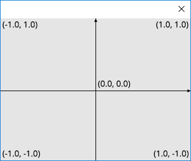

Program
=======

.. py:currentmodule:: moderngl

ModernGL is different from standard plotting libraries.
You can define your own shader program to render stuff.
This could complicate things, but also provides freedom on how you render
your data.

Here is a sample program that passes the input vertex coordinates as is to
screen coordinates.

Screen coordinates are in the [-1, 1], [-1, 1] range for x and y axes.
The (-1, -1) point is the lower left corner of the screen.

    The screen coordinates

The program will also process a color information.

.. rubric:: Entire source

.. literalinclude:: first.2.py
    :emphasize-lines: 5-
    :linenos:

.. rubric:: Vertex Shader

.. literalinclude:: first.2.py
    :language: glsl
    :dedent: 8
    :lines: 8-17

.. rubric:: Fragment Shader

.. literalinclude:: first.2.py
    :language: glsl
    :dedent: 8
    :lines: 21-28

Proceed to the :doc:`next step <vertex_array>`.
